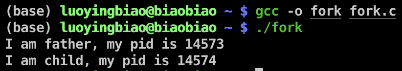
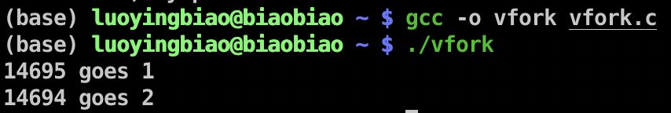
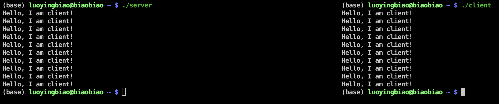
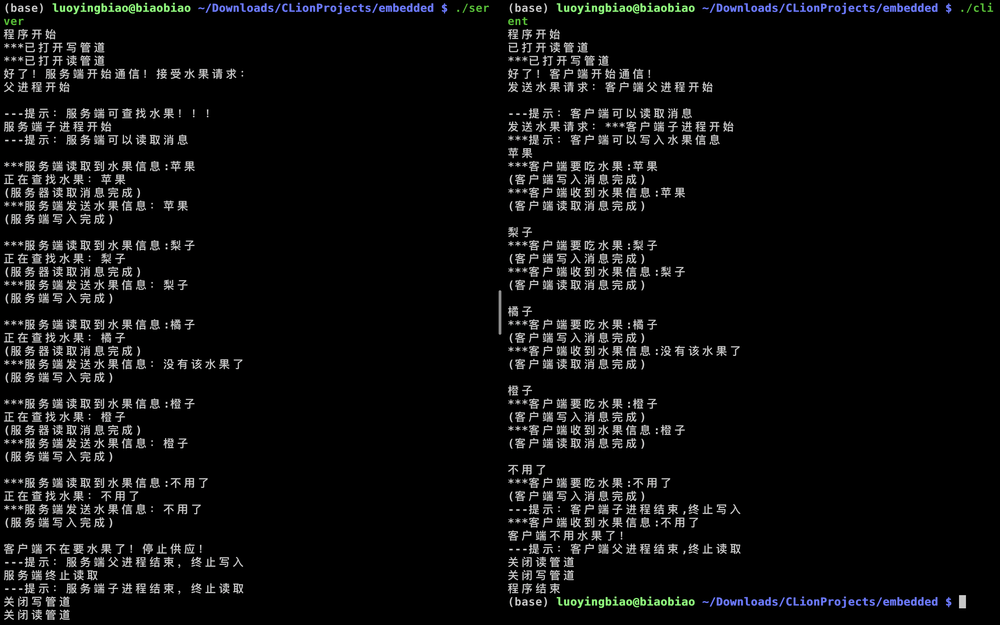

# 多进程编程

小组名称：勇哥招亲组  
小组成员：赵勇、罗颖彪、杜佳卓

- [一、实验目的](#jump1)
- [二、实验内容](#jump2)
- [三、实验过程与结果](#jump3)
- [四、实验总结](#jump4)
- [五、附实验源码](#jump5)

## <span id="jump1">一、实验目的</span>
1. 学会创建多进程程序，理解 **fork()，vfork()** 创建的子进程的特点；
2. 学会使用**有名管道**和**无名管道**实现进程间通信；
3. 学会使用**信号机制**实现进程间通信。

## <span id="jump2">二、实验内容</span>

1. 编写fork()，vfork()多进程程序，通过输出结果比较所创建的子进程的不同之处；
2. 编写fork()多进程程序，进程间模拟信号通信， 包括信号发送、捕捉与处理；
3. 编写fork()多进程程序，进程间实现有名管道和无名管道通信。具体要求如下:
    * 编写1个服务器程序server.c和2个客户端程序client1.c，client2.c，服务器和客户端之间采用FIFO管道通信；
    * 服务器和客户端各自创建自己的子进程，父进程负责完成FIFO管道通信，子进程负责输出接收到的信息， 父子进程间采用无名管道通信。

## <span id="jump3">三、实验过程与结果</span>

### 3.1 fork()和vfork()
<details>
<summary>
vfork()与fork()的区别与联系
</summary>
<br/>
简单的说，vfork()跟fork()类似，都是创建一个子进程，这两个函数的的返回值也具有相同的含义。但是vfork()创建的子进程基本上只能做一件事，那就是立即调用_exit()函数或者exec函数族成员，调用任何其它函数（包括exit()）、修改任何数据（除了保存vfork()返回值的那个变量）、执行任何其它语句（包括return）都是不应该的。此外，调用vfork()之后，父进程会一直阻塞，直到子进程调用_exit()终止，或者调用exec函数族成员。

关于如何正确使用vfork()，上面这一段就是全部了。但是为什么vfork()会这样呢？ 其实vfork()和fork()之间只有两点不同：

1. fork()会复制父进程的页表，而vfork()不会复制，直接让子进程共用父进程的页表；
2. fork()使用了写时复制技术，而vfork()没有，它任何时候都不会复制父进程地址空间。

即使算上vfork()会阻塞父进程而fork()不会，也只有三点不同，没有更多不同了。所以vfork()产生的子进程跟父进程完全共同使用同一个地址空间，甚至共享同一个函数堆栈！也就是子进程中对任何数据变量的修改，不管是局部的还是全局的，都会影响到父进程。而任何一个函数调用都会修改栈空间，这就是为什么vfork()的子进程不能随便调用别的函数。

但需要注意的是，由于vfork()毕竟还是产生一个新的进程，所以子进程拥有自己的进程描述符，拥有自己的寄存器，最重要的是，拥有自己的打开文件列表！

注意拥有自己的打开文件列表非常重要，因为如果子进程只是简单地共用父进程的打开文件列表，那么当子进程调用_exit()退出时,\_exit()内部会自动关闭当前进程打开的所有文件描述符，也就是打开文件列表里面的文件，这将导致父进程恢复执行时，无法访问到自己之前已经打开过的文件，包括标准输入、标准输出和标准错误输出。所幸的是这永远不会发生，子进程会复制父进程的打开文件列表，并增加文件引用计数。

那为什么vfork()子进程中可以调用_exit()，却不可以调用exit()，也不可以直接return呢？

exit()是对_exit()的封装，它自己在调用_exit()前会做很多清理工作，其中包括刷新并关闭当前进程使用的流缓冲（比如stdio.h里面的printf等），由于vfork()的子进程完全共享了父进程地址空间，子进程里面的流也是共享的父进程的流，所以子进程里面是不能做这些事的。

直接return就更不行了，子进程return以后，会从当前函数的外部调用点后面继续执行，这后面子进程可能将会执行很多语句，结果就没法预料了。
</details>

#### 3.1.1 fork()

```c
#include <unistd.h>
#include <stdio.h>

int main()
{
    int pid = fork();

    if (pid == -1)
        return -1;

    if (pid)
    {
        printf("I am father, my pid is %d\n", getpid());
        return 0;
    }
    else
    {
        printf("I am child, my pid is %d\n", getpid());
        return 0;
    }
}
```
结果：


#### 3.1.2 vfork()

```C
#include <stdio.h>
#include <unistd.h>

void stack1() {
    vfork();
}

void stack2() {
    _exit(0);
}

int main() {
    stack1();
    printf("%d goes 1\n", getpid());
    stack2();
    printf("%d goes 2\n", getpid());
    return 0;
}
```
父进程pid为14694，子进程pid为14695，输出结果是：



### 3.2 模拟进程间通信
服务端
```c
#include<stdio.h>
#include<unistd.h>
#include<sys/stat.h>
#include<sys/types.h>
#include<fcntl.h>
#include<string.h>

int main() {
  int fd = open("./fifo1",O_RDONLY);
  int i = 0;
  char buf[24]={0};
  while(read(fd, buf, 24)>0){
    printf(buf);
  }
  close(fd);
  return 0;
}

```
客户端
```c
#include<stdio.h>
#include<unistd.h>
#include<sys/stat.h>
#include<sys/types.h>
#include<fcntl.h>
#include<string.h>
int main() {
  char* msg = "Hello, I am client!\n";
  int fd=open("./fifo1", O_WRONLY);
  int i = 0;
  for(;i<10;i++){
    printf(msg);
    if(write(fd, msg, strlen(msg)+1)<0){
      _exit(-1);
    }
    sleep(2);
  }
  close(fd);
  return 0;
}
```
结果：


### 3.3 有名管道和无名管道通信
服务端
```c
//
// Created by 罗颖彪 on 2020/3/23.
//

#include <sys/types.h>
#include <sys/stat.h>
#include <unistd.h>
#include <limits.h>
#include <fcntl.h>
#include <stdlib.h>
#include <stdio.h>
#include <string.h>

#define SERVER_W "serverWrite"
#define SERVER_R "serverRead"

int searchFruit(const char* table[], const int size, const char* key)
{
    int i;
    printf("正在查找水果：%s\n", key);
    for (i = 0; i < size; i++)
    {
        printf("%s", table[i]);
        printf("\t%s\n", key);
        if (table[i]==key)
        {
            return 1;
        }

    }
    if(key=="不用了"){
        return 2;
    }
    return 0;
}

void main(){
    printf("程序开始\n");
    //服务端读写文件描述符
    int fd_w,fd_r;
    //服务端读写管道
    int pid_w,pid_r;
    //读写数组
    char msg_w[BUFSIZ],msg_r[BUFSIZ];
    //进程id
    pid_t pid;

    char string[1000];
    int result = -1;
    int fd[2], nbytes;
    int *write_fd = &fd[1];
    int *read_fd = &fd[0];

    int fruit_class = 4;
    const char *fruits[] = {"苹果", "apple","香蕉","橙子"};
    int exist_fruit;
    char *have_fruit;
    char *key;

    // 无名管道，用于父子进程通信
    result = pipe(fd);
    if(result == -1)
    {
        perror("创建无名管道失败");
        return;
    }

    //首先要检查文件的存在性, access 存在返回0，不存在返回-1
    //写管道
    if(access(SERVER_W,0) < 0){
        //文件不存在，创建管道
        pid_w = mkfifo(SERVER_W,0700);
        if(pid_w < 0){
            perror("服务器创建写管道失败");
            return;
        }
        printf("管道%s创建成功\n",SERVER_W);
    }
    //存在则打开管道
    fd_w = open(SERVER_W,O_RDWR);
    if(fd_w < 0){
        perror("打开写管道失败");
    }
    printf("***已打开写管道\n");

    //读管道
    if(access(SERVER_R,0) < 0){
        //文件不存在，创建管道
        pid_r = mkfifo(SERVER_R,0700);
        if(pid_r < 0){
            perror("创建读管道失败");
            return;
        }
        printf("管道%s创建成功\n",SERVER_R);
    }
    //存在则打开
    fd_r = open(SERVER_R,O_RDWR);
    if(fd_r < 0){
        perror("打开读管道失败");
    }
    printf("***已打开读管道\n");

    printf("好了！服务端开始通信！接受水果请求：\n");

    pid = fork();
    if(pid<0){
        perror("子进程创建失败\n");
    }else if (pid==0){
        //子进程用于持续读
        printf("服务端子进程开始\n");
        printf("-----提示：服务端可以读取消息\n");
        while(1){
            if( read(fd_r, msg_r, BUFSIZ) == -1){
                perror("服务端读取消息失败");
            }else{
                if(strlen(msg_r)>0){
                    printf("***服务端读取到水果信息:%s\n", msg_r);
                    printf("%s\n", msg_r);
                    if(strcmp("苹果", msg_r)==0){
                        printf("是苹果！！！");
                    }

                    //有无水果
                    exist_fruit = searchFruit(fruits, fruit_class, msg_r);
                    printf("exist fruit: %d\n", exist_fruit);
                    if(exist_fruit==1){
                        have_fruit = msg_r;
                    } else if (exist_fruit==2){
                        have_fruit = "不用了";
                    } else{
                        have_fruit = "没有该水果了";
                    }

                    if(strcmp("不用了", msg_r)==0){
                        printf("服务端终止读取\n");
                        break;
                    }
                } else{
                    printf("服务端无可读消息\n");
                }
                printf("(服务器读取消息完成)\n");
            }
            //将有无水果写入无名管道
            close(*read_fd);
            result = write(*write_fd, have_fruit, strlen(have_fruit)+1);
        }
        printf("---------提示：服务端子进程结束，终止读取\n");
        _exit(0);
    } else{
        //父进程用于持续写
        printf("父进程开始\n");
        printf("\n----------提示：服务端可查找水果！！！\n");
        while(1){
            close(*write_fd);
            nbytes = read(*read_fd, msg_w, sizeof(msg_w)-1);

            if( write(fd_w, msg_w,strlen(msg_w)+1) == -1){
                perror("服务端发送消息失败");
            } else{
                printf("***服务端发送水果信息：%s\n",msg_w);
                printf("(服务端写入完成)\n\n");
                if(strcmp("不用了", msg_w)==0){
                    printf("客户端不在要水果了！停止供应！");
                    break;
                }
            }
        }
        printf("---------提示：服务端父进程结束，终止写入\n");
        wait(NULL);
    }

    close(fd_w);
    printf("关闭写管道\n");
    close(fd_r);
    printf("关闭读管道\n");
    printf("程序结束\n");
    return;
}
```

客户端
```c
//
// Created by 罗颖彪 on 2020/3/23.
//
#include <sys/types.h>
#include <sys/stat.h>
#include <unistd.h>
#include <limits.h>
#include <fcntl.h>
#include <stdlib.h>
#include <stdio.h>
#include <string.h>

#define SERVER_W "serverWrite"
#define SERVER_R "serverRead"

void main(){
    //客户端的读是服务端的写，服务端的写是客户端的读
    printf("程序开始\n");
    //客户端读写文件描述符
    int fd_w,fd_r;
    //客户端读写管道
    int pid_w,pid_r;
    //读写数组
    char msg_w[BUFSIZ],msg_r[BUFSIZ];
    //进程id
    pid_t pid;

    //首先检查文件的存在性,access 存在返回0，不存在返回-1
    //读管道
    if(access(SERVER_W,0) < 0){
        //文件不存在，创建管道
        pid_r = mkfifo(SERVER_W,0700);
        if(pid_r < 0){
            perror("创建读管道失败");
            return;
        }
        printf("***管道%s创建成功\n",SERVER_W);
    }
    //存在则打开
    fd_r = open(SERVER_W,O_RDWR);
    if(fd_r < 0){
        perror("打开读管道失败");
    }
    printf("已打开读管道\n");

    //写管道
    if(access(SERVER_R,0) < 0){
        //文件不存在，创建管道
        pid_w = mkfifo(SERVER_R,0700);
        if(pid_w < 0){
            perror("客户端创建写管道失败:");
            return;
        }
        printf("***管道%s创建成功\n",SERVER_R);
    }
    //存在则打开管道
    fd_w = open(SERVER_R,O_RDWR);
    if(fd_w < 0){
        perror("打开写管道失败");
    }
    printf("***已打开写管道\n");

    printf("好了！客户端开始通信！\n发送水果请求：");

    pid = fork();
    if(pid < 0){
        perror("子进程创建失败\n");
    }else if(pid == 0){
        //子进程用于持续写
        printf("***客户端子进程开始\n");
        printf("***提示：客户端可以写入水果信息\n");
        while(1){
            scanf("%s",msg_w);

            if ( write(fd_w,msg_w,strlen(msg_w)+1) == -1){
                perror("客户端发送消息失败");
            }else{
                printf("***客户端要吃水果:%s\n",msg_w);
                printf("(客户端写入消息完成)\n");
                if (strcmp("不用了",msg_w) == 0){
                    break;
                }
            }
        }//while
        printf("-------------提示：客户端子进程结束,终止写入\n");
        _exit(0);
    }else{
        //父进程用于持续读
        printf("客户端父进程开始\n");
        printf("\n-----------提示：客户端可以读取消息\n");
        while(1){
            if( read(fd_r,msg_r,BUFSIZ) == -1 ){
                perror("客户端读取消息失败");
            }else{
                if( strlen(msg_r) > 0 ){
                    printf("************客户端收到水果信息:%s\n",msg_r);
                    if (strcmp("不用了",msg_r) == 0){
                        printf("客户端朋友丢失，无法读取消息\n");
                        break;
                    }
                }else{
                    printf("客户端无可读消息\n");
                }
                printf("(客户端读取消息完成)\n\n");
            }
        }//while
        printf("---------------------提示：客户端父进程结束,终止读取\n");
        wait(NULL);
    }

    //关闭文件
    close(fd_w);
    printf("关闭读管道\n");
    close(fd_r);
    printf("关闭写管道\n");
    printf("程序结束\n");
    return;
}
```
结果：


## <span id="jump4">四、实验总结</span>

### 4.1 实验收获
✅熟悉和理解了利用pipe和fifo进行进程间通信。

### 4.2 未解决问题
⚠️从fifo文件读取到的字符串与程序中定义的字符串**不相同**，因此造成对字符信息处理有误，尚未解决。
## <span id="jump5">五、附实验源码</span>
✅见code文件夹
