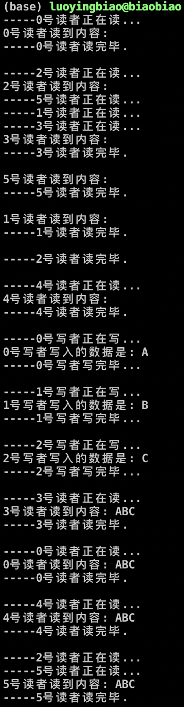

# 多线程编程

小组名称：勇哥招亲组  
小组成员：罗颖彪、杜佳卓、赵勇

- [一、实验目的](#jump1)
- [二、实验内容](#jump2)
- [三、实验过程与结果](#jump3)
- [四、实验总结](#jump4)
- [五、附实验源码](#jump5)

## 一、实验目的
1. 掌握基于**pthread线程库**的多线程编程技术；
2. 掌握基本的线程间同步技术(**sem，mutex**)；
3. 理解共享资源并掌握其操作方法。

## 二、实验内容

读者-写者问题多线程实现：
* 一个数据集（如数据、文件等）被N个线程读写；
* 一些线程只要求读数据集内容，称为读者 (Reader)，实验读者数不少于6个；
* 另些线程要求修改数据集内容，称为写者 (Writer)，实验写者数不少于3个；
* 多个读者可以同时读数据集内容，不需要互斥操作；
* 一个写者不能和其他写者或读者同时访问数据集，换句话说，写者和其他写者或读者之间必须互斥操作！
* **读者优先：如果有读者，写者需要等待！用于更新不频繁或更新影响不显著、读者较多的场合；**
* **写者优先：如果有写者，读者需要等待！用于更新频繁或更新影响显著的场合。**

## 三、实验过程与结果

## 3.1 读者优先：

(源码见[rw_reader_first.cpp](./code1/rw_reader_first.cpp))

运用Posix互斥锁，使用”读者优先”策略解决”读者写者问题”.

**解题思路:**  

如果新读者到：
1. 无读者、写者，新读者可以读；
2. 有写者等待，但有其它读者正在读，则新读者也可以读；
3. 有写者写，新读者等待。

如果新写者到：
1. 无读者，新写者可以写；
2. 有读者，新写者等待；
3. 有其它写者，新写者等待。

**小结:**  

读者优先的设计思想是读进程只要看到有其它读进程正在读，就可以继续进行读；写进程必须等待所有读进程都不读时才能写，即使写进程可能比一些读进程更早提出申请。该算法只要还有一个读者在活动，就允许后续的读者进来，该策略的结果是，如果有一个稳定的读者流存在，那么这些读者将在到达后被允许进入。而写者就始终被挂起，直到没有读者为止.

**结果：**

## 四、实验总结

### 4.1 实验收获
✅熟悉了POSIX线程操作，明白了通过信号量、互斥锁进行线程间同步和互斥和对共享资源的使用。

### 4.2 未解决问题
✅无.

## 五、附实验源码
✅见[code1](./code1)文件夹
