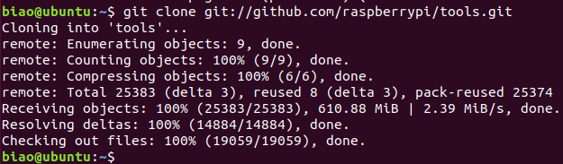
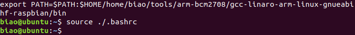
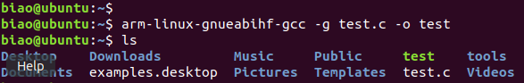
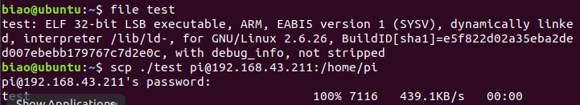
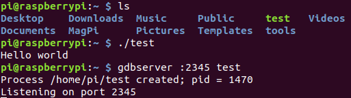
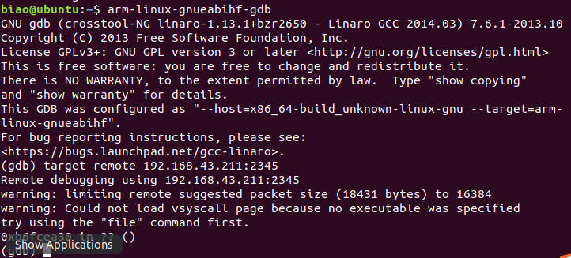
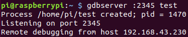
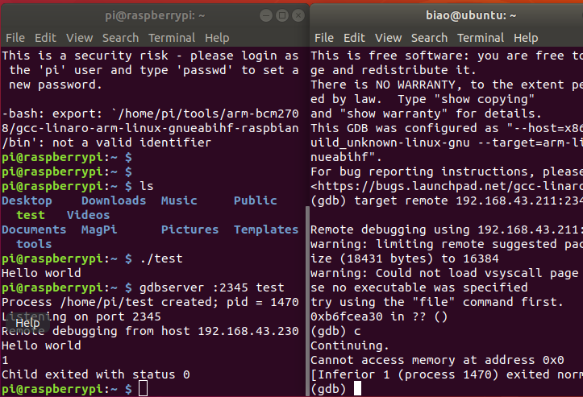

# 0B703-勇哥招亲组-构建主机端开发环境(下)

小组名称：勇哥招亲组  
小组成员：罗颖彪、杜嘉卓、赵勇

- [一、实验目的](#jump1)
- [二、实验内容](#jump2)
- [三、实验过程与结果](#jump3)
- [四、实验总结](#jump4)
- [五、附实验源码](#jump5)

## <span id="jump1">一、实验目的</span>
1. 学会下载安装Linux及相关工具到目标机或目标机仿真环境。
2. 学会使用交叉编译器编译应用程序，并能够将可执行程序下载到目标机运行。
3. 学会使用交叉调试工具gdb-gdbserver调试应用程序。

## <span id="jump2">二、实验内容</span>

* Host-Target方案1:下载安装Linux系统到开发板，其中包括bootloader、内核、模块、库、文件系统等;建立host-target连接，常见连接有SSH，VNC，Putty。
* Host-Target方案2:下载安装目标机仿真环境qemu，安装qemu树莓派系统。
* 构建并测试开发板交叉编译器。
* 建立gdb-gdbserver交叉调试环境并能够调试应用程序。

## <span id="jump3">三、实验过程与结果</span>

### 3.1 安装目标端环境
在树莓派上安装Raspbain系统即可。

### 3.2 gdb-gdbserver交叉调试

1. 在主机端（Ubuntu）构建交叉编译工具链：
```bash
git clone git://github.com/raspberrypi/tools.git
```


2. 把编译器路径加入到系统环境变量:
```bash
exportPATH=$PATH:$HOME/rasppi/tools/arm-bcm2708/gcc-
linaro-arm-linux-gnueabihf-raspbian-x64/bin
```


3. 使用`arm-linux-gnueabihf-gcc`交叉编译测试程序，通过`SCP`将生成的可执行文件传输到目标端（树莓派）:
```bash
arm-linux-gnueabihf-gcc -g test.c -o test
```


（`file test`查看文件的类型为ARM的可执行文件）
4. 在目标端（树莓派）安装gdbserver:
```bash
sudo apt-get install gdbserver
```

5. gdb-gdbserver交叉调试:

（1）在目标端启动gdbserver，设置一个监听端口：


（2）在主机端打开`arm-linux-gnueabihf-gdb`，输入`target remote 192.168.43.211:2345`连接树莓派的gdbserver：


（3）可以在目标端看到：


（4）在主机端的gdb中输入c命令执行程序，可以在树莓派终端中看到：


至此树莓派的交叉编译和远程调试环境配置完成！

## <span id="jump4">四、实验总结</span>

### 4.1 实验收获
✅掌握了主机端和目标端之间的交叉编译和远程调试。

### 4.2 未解决问题
✅已解决：因为主机端是64位，安装的toolchain版本应该是`tools/arm-bcm2708/gcc-
linaro-arm-linux-gnueabihf-raspbian-x64/bin`下的执行文档。使用`tools/arm-bcm2708/gcc-
linaro-arm-linux-gnueabihf-raspbian/bin`不能成功编译。

## <span id="jump5">五、附实验源码</span>
✅见[code](./code)文件夹
