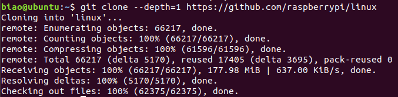

# 0B703-勇哥招亲组-构建目标系统

小组名称：勇哥招亲组  
小组成员：罗颖彪、杜嘉卓、赵勇

- [一、实验目的](#jump1)
- [二、实验内容](#jump2)
- [三、实验过程与结果](#jump3)
- [四、实验总结](#jump4)
- [五、附实验源码](#jump5)

## <span id="jump1">一、实验目的</span>

1. 掌握裁剪Linux内核的方法，理解内核选项的意义;
2. 熟悉编译内核并加载内核到目标系统的方法与过程;
3. 了解模块与内核的关系，掌握内核模块配置编译、安装与卸载流程，为进一步编程，如驱动编程打下基础;
4. 掌握创建、安装(卸载)并使用文件系统的方法。

## <span id="jump2">二、实验内容</span>

* 首先用**默认配置**重新编译一遍已安装到开发板的内核，将新的内核替换现有内核，检查是否通过!
* 在原始版本基础上，重新配置Linux内核，构建一个嵌入式的Linux内核;
* 编译安装重新配置后的内核、模块及dtbs设备树;
* 针对默认配置中不少于10个kernel feature进行重新配置(裁剪为主、偶有增加)，并解释理由;(Y=>N，N=>Y)
* 保留必要的模块安装，剩余(占多数)取消;(M=>N)
* make后将新的内核安装到开发板运行测试;
* 选择至少二个模块加载与卸载，检查是否加载、卸载成功;
* 构建并安装至少一款不同于根文件系统、用于应用开发的其它文件系统。

## <span id="jump3">三、实验过程与结果</span>

### 3.1 编译内核（默认配置）

有两种方法编译内核：第一种是直接在树莓派上编译(build locally)，这会耗费很长时间；第二种是在主机端上交叉编译(cross compile)，能较快完成编译，但步骤更复杂。本项目采用第二种方法。

（1）下载、安装交叉编译工具链：

步骤见上一作业

（2）下载内核源码：

```bash
git clone --depth=1 https://github.com/raspberrypi/linux
```



（3）安装编译必备的组件：

```bash
sudo apt-get update
sudo apt-get install bc bison flex libssl-dev make libc6-dev libncurses5-dev
```

（4）编译内核：

```bash
cd linux          # 进入内核源码顶层目录
make help         # 查看帮助(可忽略本步骤)
make distclean    # 清理编译生成的二进制文件和配置以及各种备份文件
```


## <span id="jump4">四、实验总结</span>

### 4.1 实验收获
✅掌握了

### 4.2 未解决问题
✅已解决：

## <span id="jump5">五、附实验源码</span>
✅见[code](./code)文件夹


**参考链接：**

1. [树莓官网文档：编译内核](https://www.raspberrypi.org/documentation/linux/kernel/building.md#choosing_sources)
2. [博客：编译树莓派Linux内核](https://www.pypyn.com/archives/date/2020/01/)
