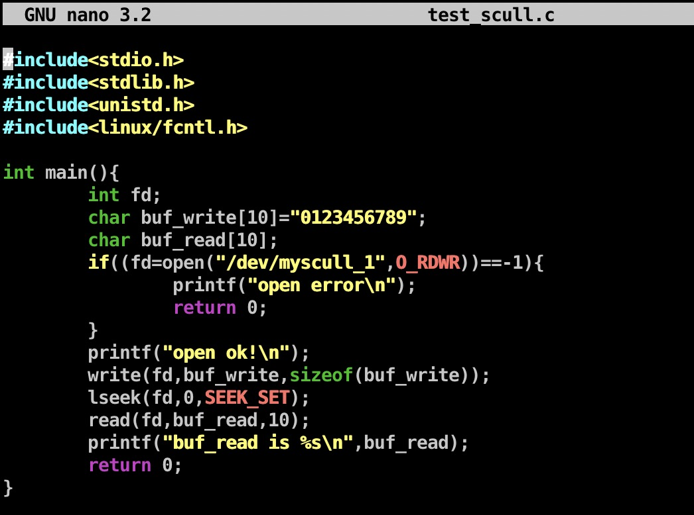
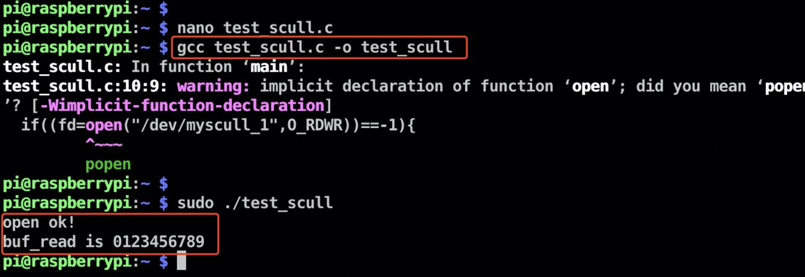
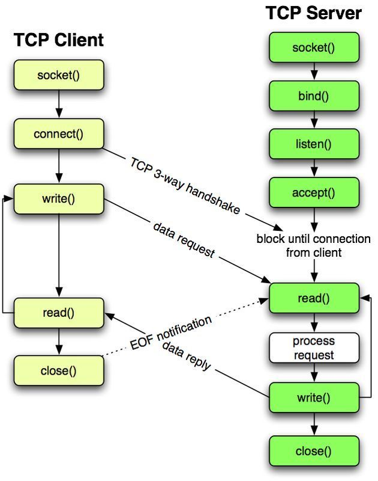
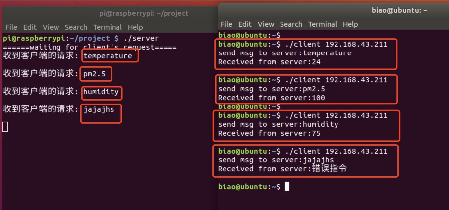

# 0B703-勇哥招亲组-综合应用实验

小组名称：勇哥招亲组  
小组成员：罗颖彪、杜嘉卓、赵勇

- [一、实验目的](#一、实验目的)
- [二、实验内容](#jump2)
- [三、实验过程与结果](#jump3)
- [四、实验总结](#jump4)
- [五、附实验源码](#jump5)

## 一、实验目的

能够综合应用课程所学的技术与工具，包括:

* Socket通信
* 多进程、多线程编程
* 交叉调试目标端程序
* 磁盘分区与文件系统创建
* 模块与驱动编程

## <span id="jump2">二、实验内容</span>

* 将树莓派设为智能家居Linux服务器，可用来采集并维护环境数据，如PM2.5、温度、湿度、气味、电器状态数据等。在实际环境中数据来自相应的传感器，本次试验中用scull设备模拟。有条件的小组鼓励使用真实设备采集数据;
* 要求创建2个以上的scull设备，设备驱动可选择从内核源码树外(Kbuild)编译安装，或加入到内核源码树内。驱动函数要求包括: open, release, read, write, llseek, ioctl;
* 实验中的环境数据存储在特定文件系统中。该文件系统要求具备属性:**在线写入、持久性、断电可靠性**;
* PC机、移动设备或另外一个树莓派用作远程客户端，随时请求获取环境数据，客户端和服务器之间采用Socket通信。
* APP编译采用交叉编译，用gdb-gdbserver交叉调试APP。

## <span id="jump3">三、实验过程与结果</span>

### 3.1 磁盘分区创建和文件系统挂载

#### 3.1.1 查看分区

在Linux系统中，管理硬盘设备最常用的方法是fdisk命令。fdisk命令用于管理磁盘分区，格式为```fdisk [磁盘名称]```，它提供了集添加、删除、转换分区等功能于一身的"一站式分区服务"。

插入U盘到树莓派的USB2.0接口，我们先用```sudo fdisk -l```查看当前硬盘分区情况：


可以观察到U盘被识别为设备文件/dev/sda，且只有一个拓展分区/dev/sda4。对物理设备命令的理解见附录：[常见硬件设备及其文件名称](#jump6)。

#### 3.1.2 使用fdisk增加分区

使用```sudo fdisk /dev/sda```进行分区。

fdisk命令中的参数以及作用：


创建拓展分区：


#### 3.1.3 格式化新分区并挂载


使用mount命令挂载的设备文件会在系统下一次重启时失效。如果想将文件系统为ext3的硬件设备/dev/sda5在开机后自动挂载到/mnt/ext3目录上，并保持默认权限且无需开机自检，就需要在/etc/fstab文件中写入下面的信息，这样在系统重启后也会成功挂载：


挂载信息写入到配置文件中：


填写格式：设备文件 挂载目录 格式类型 权限选项 自检 优先级（意义详见附录：[用于挂载信息的指定填写格式中，各字段所表示的意义](#jump7)）

如果想删除分区，需要先卸载再删除。先用unmount卸载，格式为```unmount [挂载点/设备文件]```，再用```parted [磁盘名] rm [分区号]```用来删除分区。

### 3.2 模块与设备驱动

驱动程序是硬件设备与应用程序之间的一个软件层.
(1)用户通过一组与具体设备无关的标准化的系统调用来完成相应的操作，完全隐蔽了设备的工作细节；
(2)驱动程序将这些系统调用映射到具体设备对于实际硬件的特定操作上。

* 驱动程序是内核的一部分，可以采用静态编译（修改相应的KConfig和Makefile，重新编译内核，最终）或动态加载模块（Kbuild，调试阶段）的方式来安装驱动程序进内核。

本实验中采用scull设备（是一种字符型设备）来模拟传感器数据，scull的作用是让使用者可把一块内存区域当成字符设备使用，即scull驱动的目标设备是一块内存区域 。scull不依赖于任何硬件, 只是为了展示kernel与char driver之间的接口，不具有实用功能。

字符设备（Character devices），这类设备可以像一个文件一样被打开、读写、关闭。例：文本控制台设备 /dev/console ＆串口设备/dev/ttyS0。

#### 3.2.1 字符驱动框架

|平台|打开|读|写|
|---|:---:|:---:|:---:|
|APP|open|read|write|
|C 库|system_open|system_read|system_write|
|KERNEL|scull_open | scull _read | scull _wirte|


应用程序的open通过C库的open函数，通过系统调用的system_open函数，进而通过swival指令（陷入软中断），进入内核，通过**注册函数+设备节点**的办法来找到驱动程序的open函数。

注册设备驱动函数：

register_chrdev_region(dev, 2, "scull");  --静态注册（已知主设备号）

alloc_chrdev_region(&dev, 0, 2, "scull"); --动态注册（设备号未知）

创建设备节点：mknod /dev/myscull c 240 0

（设备节点可以手工创建也可以在驱动中自动创建）

#### 3.2.2 驱动程序中的一些数据结构

**file_operations结构**：非常关键的数据结构struct file_operations，里面主要存放一些设备方法的函数指针。作用是把系统调用和驱动程序关联起来，file_operations结构的每一个成员的名字都对应着一个系统调用。用户进程利用系统调用在对设备文件进行诸如read/write操作时，系统调用通过设备文件的主设备号找到相应的设备驱动程序，然后读取这个数据结构相应的函数指针，接着把控制权交给该函数。这是linux的设备驱动程序工作的基本原理。编写设备驱动程序的主要工作就是编写子函数，并填充file_operations的各个域。

```c
struct file_operations {
  struct module *owner;
  loff_t (*llseek) (struct file *, loff_t, int);
  ssize_t (*read) (struct file *, char __user *, size_t, loff_t *);
  ssize_t (*aio_read) (struct kiocb *, char __user *, size_t, loff_t);
  ssize_t (*write) (struct file *, const char __user *, size_t, loff_t *);
  ssize_t (*aio_write) (struct kiocb *, const char __user *, size_t, loff_t);
  int (*readdir) (struct file *, void *, filldir_t);
  unsigned int (*poll) (struct file *, struct poll_table_struct *);
  int (*ioctl) (struct inode *, struct file *, unsigned int, unsigned long);
  int (*mmap) (struct file *, struct vm_area_struct *);
  int (*open) (struct inode *, struct file *);
  int (*flush) (struct file *);
  int (*release) (struct inode *, struct file *);
  int (*fsync) (struct file *, struct dentry *, int datasync);
  int (*aio_fsync) (struct kiocb *, int datasync);
  int (*fasync) (int, struct file *, int);
  int (*lock) (struct file *, int, struct file_lock *);
  ssize_t (*readv) (struct file *, const struct iovec *, unsigned long,loff_t *);
  ssize_t (*writev) (struct file *, const struct iovec *, unsigned long, loff_t *);
  ssize_t (*sendfile) (struct file *, loff_t *, size_t, read_actor_t,void __user *);
  ssize_t (*sendpage) (struct file *, struct page *, int, size_t,loff_t *, int);
  unsigned long (*get_unmapped_area) (struct file *, unsigned long,......);
};
```

**file结构**: 系统为每个打开的文件在内核中对应一个file结构，文件结构代表一个打开的文件。(它不特定给设备驱动; 系统中每个打开的文件有一个关联的 struct file 在内核空间)。 它由内核在 open 时创建, 并传递给在文件上操作的任何函数, 直到最后的关闭。 在文件的所有实例都关闭后, 内核释放这个数据结构。其中一个重要的成员就是一个file_operation结构的指针。

**inode结构**：由内核在内部用来表示文件。 因此，它和代表打开文件描述符的文件结构是不同的。需要注意的是对于单个文件也许有多个file结构，但只会有一个inode结构。
在scull中，利用scull_dev结构表示每个设备，其定义如下：

```c
struct scull_dev {
  struct scull_qset *data;  /* Pointer to first quantum set */
  int quantum;                /* the current quantum size */
  int qset;                     /* the current array size */
  unsigned long size;       /* amount of data stored here */
  unsigned int access_key;  /* used by sculluid and scullpriv */
  struct semaphore sem;     /* mutual exclusion semaphore     */
  struct cdev cdev;          /* Char device structure  */
};
```

关于cdev字符设备的数据结构：

```C
struct cdev {
    struct kobject kobj;
    struct module *owner;   //所属的模块
    const struct file_operations *ops; //文件操作结构
    struct list_head list;
    dev_t dev;   //int类型的设备号高12位主，低20位次
    unsigned int count;
};
```

#### 3.2.3 主设备号和次设备号
每个字符设备和块设备都必须有主、次设备号，主设备号相同的设备使用相同的驱动程序，次设备号用于区分具体设备的实例，即主设备号和次设备号能够唯一地标识一个设备。
可以通过```ls -l /dev```命令列出所有设备，可以查看设备的主次设备号。

#### 3.2.4 驱动函数

scull_open函数：

```C
int scull_open(struct inode *inode,struct file *filp)
{
  struct scull_dev *dev;
	dev = container_of(inode->i_cdev,struct scull_dev,cdev);//通过指针struct cdev*来获得struct scull_dev*这个新指针!注意cdev数据是scull_dev结构体的成员变量名,inode->i_cdev是指向cdev变量类型的指针.
	filp->private_data = dev;//for other methods
	if((filp->f_flags & O_ACCMODE) == O_WRONLY)//只写的方式打开设备(涉及到多进程写。。)
    {
		;
    }
	return 0;
}
```

scull_release函数：

```C
int scull_release(struct inode *inode , struct file *filp)
{
	printk(KERN_NOTICE "Scull released.\n");
	return 0;
}
```

scull_read函数:

```C
ssize_t scull_read(struct file *filp , char __user *buf, size_t count, loff_t *f_pos)
{
	ssize_t retval = 0;
	struct scull_dev *dev = filp->private_data;//将设备数据赋值给变量dev,为提取设备数据做准备!
	if (*f_pos >= dev->size)   //超过了设备数据量，文件指针的位置已经不在设备中了！
		goto out;
	if (*f_pos + count > dev->size)   //count太大，确保文件指针在文件中，数据量有效
		count = dev->size - *f_pos;
	if (copy_to_user(buf, dev->scull_buf + *f_pos , count)) {
		retval = -EFAULT;
		goto out;
	}
	*f_pos += count;   //重新计算文件指针的位置
	retval = count;
out:
	return retval;
}
```

scull_write函数：

```C
ssize_t scull_write(struct file *filp , const char __user *buf,size_t count ,loff_t *f_pos)
{
	ssize_t retval = -ENOMEM; /* value used in "goto out" statements */
	struct scull_dev *dev = filp->private_data;
	if (*f_pos >= SCULL_BUFF_MAXSIZE)    //写的位置超出最大值
		goto out;
	if (*f_pos + count > SCULL_BUFF_MAXSIZE)  //写的位置+count不能超过最大值
		count = SCULL_BUFF_MAXSIZE - *f_pos;
	if (copy_from_user(dev->scull_buf + *f_pos , buf, count)) {
		retval = -EFAULT;
		goto out;
	}
	*f_pos += count;  //f_pos位置更新
	retval = count;
	if (dev->size < *f_pos)  //更新size大小
		dev->size = *f_pos;
out:
	return retval;
}
```

scull_llseek函数：

```C
loff_t scull_llseek(struct file *filp,   //设备文件
					loff_t offset,       //偏移量
					int whence)          //seek方式
{
	struct scull_dev *dev = filp->private_data;
	loff_t tmp_pos;
	switch (whence) {
		case 0:    	//SEEK_SET
			tmp_pos = offset;
			break;
		case 1:     // SEEK_CUR
			tmp_pos =  filp->f_pos + offset;
			break;
		case 2: 	//SEEK_END
			tmp_pos = dev->size + offset;
		default:   //can't happen
			return -EINVAL;
	}
	if ((tmp_pos >  SCULL_BUFF_MAXSIZE)  || (tmp_pos < 0))
		return -EINVAL;
	return filp->f_pos = tmp_pos;  
}
```

scull_ioctl函数：

```C
long scull_ioctl(struct file *filp,    //设备文件
				unsigned int cmd,     //功能号
				unsigned long arg)    //参数，值，或者用户空间指针
{
	if (cmd == SCULL_CMD1) {
		printk("running  SCULL_CMD1 \n");
		return 0;
	}
	if (cmd == SCULL_CMD2) {
		printk("running  SCULL_CMD2 \n");
		return 0;
	}
	if (cmd == SCULL_CMD3) {
		printk("running  SCULL_CMD3 \n");
		return 0;
	}
	printk("cmd  error! \n");
	return -EFAULT;  
}
```

驱动完整代码：

[scull_rpi.c](./code.scull_rpi.c)

[Makefile](./code/Makefile)文件

```bash
ifneq ($(KERNELRELEASE),)
obj-m:=scull_rpi.o
else
KERNELDIR:=/home/biao/linux
PWD:=$(shell pwd)
all:
	$(MAKE) -C $(KERNELDIR) M=$(PWD) modules ARCH=arm CROSS_COMPILE=arm-linux-gnueabihf-
clean:
	rm -f *.ko *.o *.mod.c *.symvers modul*
endif
```

注意Makefile中的/home/biao/linux是树莓派内核源码树目录，make时要加上ARCH=arm CROSS_COMPILE=arm-linux-gnueabihf-。

交叉编译驱动模块：


然后将交叉编译的scull_rpi.ko模块通过scp命令传输至树莓派。

登录树莓派，在模块所在目录执行```sudo insmod scull_rpi.ko```安装到树莓派内核中，```lsmod```查看：


通过```cat /proc/devices```查看分配给scull(驱动名称)的主设备号，实验中动态分配：


通过```ls /dev```查看安装模块时创建的设备节点（命名为myscull_?），通过```ls -l /dev/myscull_*```查看所创建的3个设备节点的设备号：


#### 3.2.5 测试scull驱动

scull驱动模块安装完成后，已自动创建3个设备，需要编写简单的测试程序测试驱动是否正确（open等函数能否映射到驱动程序中的scull_open接口并完成正确操作）。测试程序如下：



在树莓派上gcc编译执行结果如下：（可见scull设备驱动基本正确，open，read，write，llseek等函数功能正常）：



最后可以通过 sudo rmmod scull_rpi 来卸载驱动，卸载后创建的设备也会自动删除。

### 3.3 Socket通信

Socket通信用于树莓派（服务端）与PC或者另一块树莓派（客户端）进行通信。Socket通信是“open—write/read—close”模式的一种实现。在本次实验中，客户端通过socket通信向服务端发送请求命令，请求获取环境数据，服务端会从挂载点读取环境数据然后发送给客户端。

#### 3.3.1 Socket函数介绍

在socket通信中主要分为socket()函数、bind()函数、listen()、connect()函数、accept()函数、read()、write()函数、close()函数等。

1. socket()函数：```int socket(int domain, int type, int protocol)```  
socket函数对应于普通文件的打开操作。普通文件的打开操作返回一个文件描述字，而socket()用于创建一个socket描述符（socket descriptor），它唯一标识一个socket。这个socket描述字跟文件描述字一样，后续的操作都有用到它，把它作为参数，通过它来进行一些读写操作。

2. bind()函数：```int bind(int sockfd, const struct sockaddr *addr, socklen_t addrlen)```  
bind()函数把一个地址族中的特定地址赋给socket。例如对应AF_INET、AF_INET6就是把一个ipv4或ipv6地址和端口号组合赋给socket。

3. listen()、connect()函数：```int listen(int sockfd, int backlog)```；```int connect(int sockfd, const struct sockaddr *addr, socklen_t addrlen)```  
作为一个服务器，在调用socket()、bind()之后就会调用listen()来监听这个socket，如果客户端这时调用connect()发出连接请求，服务器端就会接收到这个请求。

4. accept()函数：```int accept(int sockfd, struct sockaddr *addr, socklen_t *addrlen)```  
TCP服务器端依次调用socket()、bind()、listen()之后，就会监听指定的socket地址了。TCP客户端依次调用socket()、connect()之后就想TCP服务器发送了一个连接请求。TCP服务器监听到这个请求之后，就会调用accept()函数取接收请求，连接建立成功。之后就可以开始网络I/O操作了，即类同于普通文件的读写I/O操作。

5. read()、write()等函数：网络I/O操作有下面几组：read()/write()、
recv()/send()、readv()/writev()、recvmsg()/sendmsg()、recvfrom()/sendto().

6. close()函数：在服务器与客户端建立连接之后，会进行一些读写操作，
完成了读写操作就要关闭相应的socket描述字。

Socket通信示意图




#### 3.3.2 Socket通信实践

在挂载的U盘中存储```humidity.txt pm25.txt temperature.txt```三个文件，代表不同驱动在环境中获取的数据：


Ubuntu系统为客户端，向树莓派（服务端）发送请求获取环境数据，过程如下（服务端源码见[server.c](./code/server.c)，客户端源码见[client.c](./code/client.c)）：



## <span id="jump4">四、实验总结</span>

### 4.1 实验收获
✅掌握了文件系统的安装与挂载，简单驱动程序的编写和socket通信。

### 4.2 未解决问题
✅无。

## <span id="jump5">五、附实验源码</span>
✅见[code](./code)文件夹


**参考资料：**

1. 《Linux就该这么学》，刘遄。


**附录：**
1. <span id="jump6">常见硬件设备及其文件名称</span>

|硬件设备|文件名称|
| :---: | :--- |
|IDE设备|/dev/hd[a-d]|
|SCSI/SATA/U盘|/dev/sd[a-p]|
|软驱|/dev/fd[0-1]|
|打印机|/dev/lp[0-15]|
|光驱|/dev/cdrom|
|鼠标|/dev/mouse|
|磁带机|/dev/st0或/dev/ht0|

由于现在IDE设备已经比较少见，所以一般硬盘设备都会以"/dev/sd"开头。而一台主机上可以有多块硬盘，因此系统采用a~p来代表16块不同的硬盘（默认从a开始分配），而且硬盘的分区编号也很有讲究：
* 主分区或扩展分区的编号从1开始，到4结束；（可以将扩展分区理解为一个指向另一个分区的指针）
* 逻辑分区从编号5开始。

2. <span id="jump7">用于挂载信息的指定填写格式中，各字段所表示的意义</span>

|字段|意义|
| :---: | :--- |
|设备文件|一般为设备的路径+名称，也可以写唯一识别码(UUID, Universally Unique Identifier)|
|挂载目录|指定要挂载到的目录，需在挂载前创建好|
|格式类型|指定文件系统的格式，比如ext3、ext4、XFS、SWAP、iso9660(此为光盘设备)等|
|权限选项|若设置为defaults，则默认权限为：rw,suid,dev,exec,suto,nouser,async|
|自检|若为1则开机后进行磁盘自检，为0则不自检|
|优先级|若“自检”字段为1，则可对多块硬盘进行自检优先级设置|
